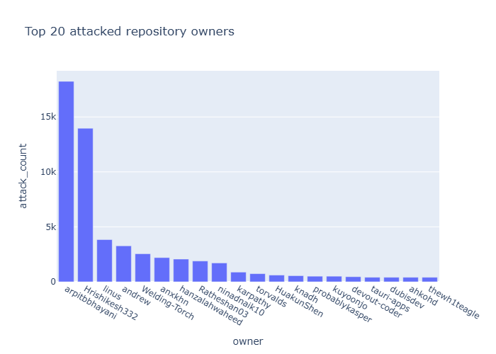
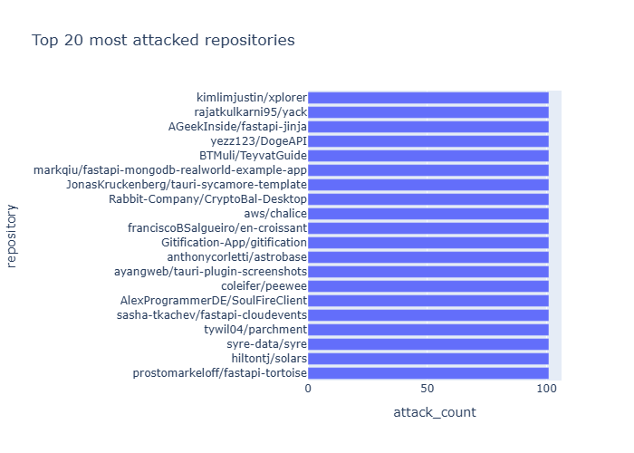
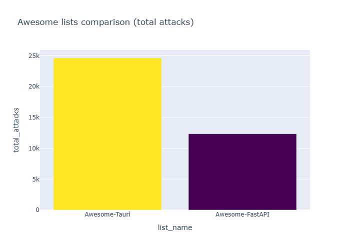

# Sha1-Hulud 2.0 Attack on GitHub Stars Analysis Toolkit

This repository contains a forensic toolkit and analysis report regarding the **Sha1-Hulud 2.0** supply chain attack observed in late November 2025.

By analyzing data from 101 compromised victim accounts (anonymized), we identified specific targeting patterns and the systematic exploitation of "Awesome" lists as attack vectors. This attack represents a sophisticated campaign that weaponized supply chain compromises to manipulate GitHub's star system.

## Table of Contents

- [Background](#background)
- [Key Findings](#key-findings)
- [Installation](#installation)
- [Configuration](#configuration)
- [Usage](#usage)
- [Star Cleanup Tool](#star-cleanup-tool)
- [Analysis Results](#analysis-results)
- [Data Structure](#data-structure)
- [References](#references)

## Background

The Sha1-Hulud 2.0 attack was a supply chain compromise that began around November 24, 2025. Attackers compromised npm package maintainers' tokens through phishing, then pushed malicious updates that exploited `preinstall` hooks to steal credentials and propagate further.

Beyond the primary objective of credential theft, the attackers used compromised accounts to:
- Inject advertisement messages into repository descriptions (`# Free AI at api.airforce`)
- Star-bomb specific repositories to artificially inflate their popularity
- Target projects listed in curated "Awesome" lists, particularly Tauri and FastAPI ecosystems

This toolkit was developed to analyze the attack patterns and understand the targeting methodology.

## Key Findings

Our analysis of 101 compromised accounts revealed:

### Awesome List Targeting

The attack systematically targeted repositories from curated lists with over 85% coverage:

| List Name           | Total Attacks | Attacked Repos | Total Repos | Coverage   |
| ------------------- | ------------- | -------------- | ----------- | ---------- |
| **Awesome-FastAPI** | 12,346        | 127            | 134         | **94.78%** |
| **Awesome-Tauri**   | 24,638        | 244            | 283         | **86.22%** |

### Top Targeted Repository Owners

| Owner         | Total Stars Received |
| ------------- | -------------------- |
| arpitbbhayani | 18,240               |
| Hrishikesh332 | 13,973               |
| linus         | 3,840                |
| andrew        | 3,267                |
| Welding-Torch | 2,548                |

### Attack Distribution Pattern

- **371 repositories** received exactly **101 stars** (the full victim count)
- **387 repositories** received **100+ stars**
- Clear threshold at ~80 stars, suggesting prioritization logic
- For Awesome-FastAPI: 122 out of 127 targeted repos received 90+ stars

### Visualization

Analysis generates both HTML interactive charts and PNG static images in `analysis_report/`:





## Installation

This project uses Python 3.13 and [uv](https://github.com/astral-sh/uv) for dependency management.

```bash
# Clone the repository
git clone https://github.com/pilgrimlyieu/Sha1-Hulud-2-GitHub-Stars-Analysis
cd Sha1-Hulud-2-GitHub-Stars-Analysis

# Create virtual environment
uv venv --python 3.13

# Activate (Linux/Mac)
source .venv/bin/activate
# Activate (Windows PowerShell)
.venv\Scripts\Activate.ps1

# Install dependencies
uv sync
```

## Configuration

### Environment Variables

Create a `.env` file in the project root:

```env
# Required for data extraction
GITHUB_TOKEN=ghp_your_github_personal_access_token

# Required for anonymization (use a strong random key)
ENCRYPTION_KEY=your_secure_encryption_key_here
```

**Important**: 
- `GITHUB_TOKEN`: Requires `read:user` and `public_repo` scopes to query stargazer data
- `ENCRYPTION_KEY`: Used for deterministic HMAC-SHA256 anonymization. Use the same key across runs to maintain consistent pseudonyms

### config.json

The main configuration file controls extraction, encryption, and analysis behavior:

```json
{
  "target_repo": "pilgrimlyieu/Focust",
  "attack_start_date": "2025-11-24T00:00:00Z",
  "exclude_users": [
    "pilgrimlyieu"
  ],
  "awesome_files": {
    "Awesome-Tauri": "awesome_tauri.csv",
    "Awesome-FastAPI": "awesome_fastapi.csv"
  },
  "output_dir": "analysis_report",
  "unencrypted_input": "attack_data.csv",
  "encrypted_output": "attack_data_encrypted.csv",
  "github_token_env": "GITHUB_TOKEN",
  "encryption_key_env": "ENCRYPTION_KEY",
  "concurrency": 10
}
```

**Configuration Fields**:

- `target_repo`: The repository to analyze stargazers for (format: `owner/repo`)
- `exclude_users`: List of legitimate users to exclude from analysis (e.g., repository owner)
- `awesome_files`: Mapping of Awesome list names to their cached CSV files
- `output_dir`: Directory to save analysis outputs
- `unencrypted_input`: Filename for raw extracted data
- `encrypted_output`: Filename for anonymized data
- `github_token_env`: Environment variable name for GitHub token
- `encryption_key_env`: Environment variable name for encryption key
- `concurrency`: Number of concurrent API requests for extraction

## Usage

### 1. Extract Stargazer Data

Fetch stargazer data from GitHub API for the configured target repository:

```bash
python -m main --extract
```

This will:
- Query GitHub API for all stargazers of `target_repo`
- Exclude users listed in `exclude_users`
- Save raw data to `attack_data.csv` with columns: `victim_user`, `target_repo`, `starred_at`

**Note**: Requires `GITHUB_TOKEN` in environment.

### 2. Anonymize Data

Encrypt sensitive user information using HMAC-SHA256:

```bash
python -m main --encrypt
```

This will:
- Read `attack_data.csv`
- Apply deterministic anonymization to `victim_user` column
- Write to `attack_data_encrypted.csv`

**Note**: Uses `ENCRYPTION_KEY` from environment. Same key produces same pseudonyms.

### 3. Run Analysis

Analyze attack patterns and generate reports:

```bash
python -m analysis
```

This will:
- Load `attack_data_encrypted.csv`
- Fetch and parse configured Awesome lists
- Generate CSV summaries in `output_dir/`:
  - `owners.csv` - Top targeted repository owners
  - `repos.csv` - Top targeted repositories
  - `awesome_summary.csv` - Cross-list attack statistics
  - `awesome_detail_*.csv` - Per-list detailed breakdown
- Generate visualizations (HTML + PNG):
  - `chart_1_top_owners.html/png` - Bar chart of top owners
  - `chart_2_top_repos.html/png` - Bar chart of top repos
  - `chart_3_awesome_comparison.html/png` - Comparison of Awesome lists
  - `awesome_chart_*.html` - Per-list attack distribution

### Combined Workflow

For a fresh analysis from scratch:

```bash
# Extract fresh data from GitHub
python -m main --extract

# Anonymize the data
python -m main --encrypt

# Generate analysis
python -m analysis
```

## Star Cleanup Tool

If your repository was victimized by the Sha1-Hulud 2.0 attack, you can use the **Star Cleanup Tool** in the `tools/` directory to remove malicious stars.

### Quick Start

The cleanup tool identifies compromised accounts by cross-referencing stargazers between your repository and known victimized repositories, then removes their stars using GitHub's block/unblock mechanism.

```bash
cd tools
python clean_stars.py
```

### Requirements

**GitHub Fine-grained Personal Access Token** with:
- **Read access to starring** - to fetch stargazer lists
- **Read and Write access to blocking** - to block/unblock users

### Configuration

Edit `tools/clean_stars.py`:

```python
# Your GitHub token
GITHUB_TOKEN = "github_pat_11AXXXXXXXXXXXXX"

# Your repository to clean
MY_REPO = "your-username/your-repo"

# Reference repositories (other confirmed victims)
REF_REPOS = [
    "some-username/some-repo",
    "another-username/another-repo",
]
```

The tool will:
1. Fetch stargazers from your repo and reference repos
2. Identify overlapping users (likely compromised accounts)
3. Remove their stars by temporarily blocking and unblocking them
4. Provide a summary of cleaned stars

**See [tools/README.md](tools/README.md) for detailed documentation, token setup instructions, and usage examples.**

⚠️ **Warning**: Star removal is irreversible. Legitimate users who coincidentally starred both repositories will also lose their star. Choose reference repositories carefully to minimize false positives.

## Analysis Results

The analysis pipeline produces multiple output formats:

### CSV Summaries

- **owners.csv**: Aggregated star counts by repository owner
- **repos.csv**: Individual repositories ranked by attack intensity
- **awesome_summary.csv**: High-level statistics per Awesome list
- **awesome_detail_[ListName].csv**: Per-repository breakdown for each list

### Interactive Visualizations (HTML)

Plotly-generated interactive charts allowing zoom, pan, and hover details:
- Explore top 20 targeted owners
- Identify specific repositories under attack
- Compare attack intensity across Awesome lists

### Static Images (PNG)

Publication-ready static versions of all charts for embedding in documentation.

## Data Structure

### attack_data.csv (Raw)
```csv
victim_user,target_repo,starred_at
actual_username,owner/repo,2025-11-26T01:36:00Z
```

### attack_data_encrypted.csv (Anonymized)
```csv
victim_user,target_repo,starred_at
anon_a1b2c3d4,owner/repo,2025-11-26T01:36:00Z
```

### awesome_*.csv (Parsed Lists)
```csv
username,repository
owner1,repo1
```

## Project Structure

```
.
├── analysis.py               # Main analysis script
├── main.py                   # CLI entry point for extract/encrypt
├── config.json               # Configuration file
├── .env                      # Environment secrets (not in repo)
├── attack_data.csv           # Raw extraction output
├── attack_data_encrypted.csv # Anonymized data
├── awesome_tauri.csv         # Cached Awesome-Tauri repos
├── awesome_fastapi.csv       # Cached Awesome-FastAPI repos
├── src/attack/               # Core package
│   ├── extract.py            # GitHub API extraction
│   ├── encrypt.py            # Anonymization utilities
│   ├── analyze.py            # Analysis and visualization
│   └── config.py             # Configuration loader
├── tools/                    # Utility scripts
│   ├── clean_stars.py        # Star cleanup tool
│   └── README.md             # Cleanup tool documentation
└── analysis_report/          # Generated outputs
    ├── *.csv                 # Summary tables
    ├── *.html                # Interactive charts
    └── *.png                 # Static charts
```

## References

- [Wiz Security Blog: Sha1-Hulud 2.0](https://www.wiz.io/blog/shai-hulud-2-0-ongoing-supply-chain-attack)
- [Suspicious Star Spikes on Specific Project, Likely Linked to Malicious Bot Activity · community · Discussion #180436](https://github.com/orgs/community/discussions/180436)

---

**Acknowledgments**: Thanks to the security research community, particularly Wiz Security, for their ongoing analysis of this attack campaign.
